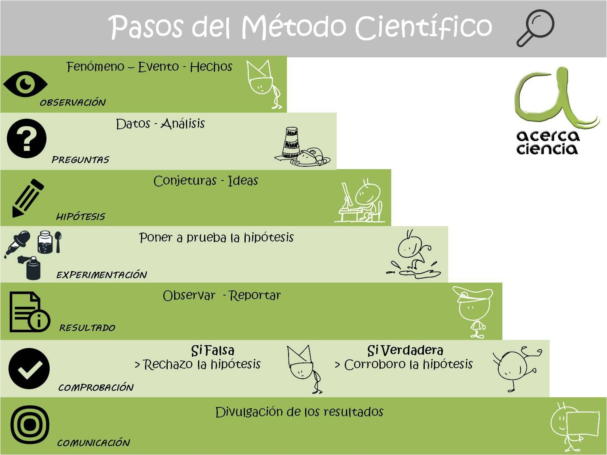

```{r setup, include=FALSE}
knitr::opts_chunk$set(echo = FALSE)
```


# Definiciones iniciales en Estadística

## Método Científico

Se entiende por un Método Científico un camino a seguir mediante una serie de operaciones, reglas y procedimientos fijados de antemano de manera voluntaria y reflexiva, para alcanzar un determinado fin que puede ser material o conceptual.

```{r fig.align='center', out.width='50%', fig.show='hold', fig.cap='Pasos del método científico. Fuente: http://www.acercaciencia.com/',echo=FALSE}

```

## Características

+ Es **Fáctico**: parte de la observación de los hechos, está basado en los hechos, tiene un referencial empírico.

+ **Trasciende los hechos**: parte de los hechos particulares no se detiene en ellos, sino que mediante un salto del nivel observacional al teórico los trasciende, los problematiza y establece leyes, teorías, etc.

+ Se atiene a **Reglas metodológicas** formales (operaciones, procedimientos establecidos de antemano) sin dejar a un lado la intuición.

+ Se vale de la **verificación empírica** para formular respuestas a los problemas planteados y para apoyar sus propias afirmaciones, exigiendo una constante confrontación con la realidad.

+ Es **autocorrectivo** y **progresivo**. _Autocorrectivo_ por rechazar, corregir o ajustar las propias conclusiones en la medida que algunos hechos demuestren la existencia de algún error u omisión. _Progresivo_ puesto que al no tomar sus conclusiones como infalibles o finales, está abierto a nuevos aportes y a la utilización de nuevas técnicas y procedimientos.

+ **Generalizante** por estar ligado a los procesos de inducción.

+ Es **objetivo** ya que busca alcanzar la verdad que los hechos muestran, independientemente de la escala de valores y creencias del científico.

## Estadística

"la tecnología del Método Científico, ya que le proporciona instrumentos para la toma de decisiones cuando prevalecen condiciones de incertidumbre" *Alexander M. Mood*

"La Estadística es una Ciencia basada en el cálculo de probabilidades, cuyo objetivo fundamental consiste en investigar la posibilidad de extraer de los datos estadísticos, inferencias válidas, elaborando los métodos mediante los cuales puedan ser obtenidas dichas inferencias" *Harald Crámer*

"La ciencia que se aplica al estudio numérico de fenómenos colectivos. Estudio que comprende la observación de los hechos, su correcta ordenación y adecuada clasificación y su análisis y tiene como fin principal el descubrimiento de características o propiedades de tipo general, para la mayoría del colectivo, pero no necesariamente a todos y cada uno de los casos" *Leo Dugué de Bernonville*

"es una rama de las matemáticas y una herramienta que estudia usos y análisis provenientes de una muestra representativa de datos, que busca explicar las correlaciones y dependencias de un fenómeno físico o natural, de ocurrencia en forma aleatoria o condicional." *Wikipedia*

## Clasificación 

1. **Estadística descriptiva**: se dedica a describir, visualizar y resumir datos a partir de fenómenos estudiados. Pretende organizar y describir las características sobre un conjunto de datos con el propósito de facilitar su aplicación.

+ Ejemplos básicos de parámetros estadísticos son: la media y la desviación estándar.
+ Ejemplos gráficos son: histograma, pirámide poblacional, gráfico circular, entre otros.

2. **Estadística inferencial**: se dedica a la generación de modelos, inferencias y predicciones asociadas a los fenómenos estudiados con base en la aleatoriedad de las observaciones. Las inferencias a su vez pueden ser de tipo:

+ *Pruebas de hipótesis:* Respuestas a preguntas de sí/no.
+ *Estimación:* Estimación de características numéricas.
+ *Prónósticos* de futuras observaciones
+ *Correlación*: descripciones de asociación
+ *Análisis de regresión:* Modelamiento de relaciones entre variables.
+ *Modelamiento:* Modelos lineales, no lineales, paramétricos, semiparamétricos, Análisis de varianza, series de tiempo, minería de datos, etc.

##

### Variable

Característica que cambia o varía con el tiempo y/o para diferentes personas u objetos bajo consideración.

### Unidad experimental

Es el individuo u objeto en el que se mide una variable.

### Colectivo o Agregado (Universo)

Conjunto de hechos numerosos de la misma naturaleza que presentan ciertas características o modalidades distintivas, cuyo comportamiento generalizado y/o posible relación son objeto de estudio.

### Población

 Conjunto de mediciones de interés para el investigador.

### Muestra

Subconjunto de mediciones seleccionado de la población de interés.

## Ejemplo:

De entre todos los alumnos de la Universidad Nacional de Colombia se slecciona un subconjunto de 5 estudiantes a quienes se les miden varias características: PAPA, sexo, ingeniería que estudia, nivel de avance, número de créditos inscritos.

Las cinco características son las *variables*. Si se considera el PAPA de todos los estudiantes de la Universidad como la población, los PAPAS de estos 5 estudiantes sería la *muestra*. Si tuviéramos todos los PAPAS de los estudiantes de la Universidad medidos, tendríamos la población de mediciones para esa variable.

##

### Datos univariados 

Cuando se mide una sola variable en una sola unidad experimental.

### Datos multivariados

Cuando se miden dos variables en una sola unidad experimental. Resultan datos multivariados cuando se miden más de dos variables.

# Clasificación de variables

## Tipos de variables

Las *variables cualitativas* miden una cualidad o característica en cada unidad experimental. Las *variables cuantitativas* miden una cantidad numérica en cada unidad experimental.

A su vez las cuantitativas se dividen en *discretas* si su recorrido es finito o infinito numerable o, bien, en *continuas* si su recorrido es infinito no numerable.

# Escalas de medición

## Escala nominal

El tipo nominal diferencia entre objetos o temas basándose únicamente en sus nombres o (meta-)categorías y otras clasificaciones cualitativas a la que pertenecen.

#### Características

+ Los números pueden ser usados para representar las variables, pero los números no tienen valor numérico o relación. Se tratan como etiquetas

+ No se permiten operaciones algebráicas (+,-,*, etc.)

+ No hay relación de orden, distancia ni proporción entre los elementos

#### Ejemplo

sexo, nacionalidad, origen étnico, idioma, género, estilo, especies biológicas, y la forma.

## Escala ordinal (orden jerárquico)

El tipo ordinal obedece a una estructura matemática de orden (primero, segundo, tercero, etc.) mediante la cual los datos pueden ser ordenados.

#### Características

+ Los números representan orden

+ No se permiten operaciones algebráicas (+,-,*, etc.)

+ Puede compararse y establecer un nivel jerárquico

#### Ejemplo

+ Datos dicotomizables: ‘enfermo’ vs. ‘saludable’ en la medición de la salud, ‘culpable’ vs. ‘inocente’ al hacer juicios en los tribunales, ‘equivocado/falso’ vs. ‘correcto/verdadero’ en la medición de la verdad justa,

+ Datos no dicotomizables: Escalas de likert (‘completamente de acuerdo’, ‘mayormente de acuerdo’, ‘mayormente en desacuerdo’, ‘completamente en desacuerdo’ cuando se mide la opinión.)

## Escala de intervalo

El tipo de escala de intervalo permite el grado de diferencia entre los elementos, pero no la relación entre ellos.

#### Características

+ El cero **NO** significa ausencia de la característica medida

+ Las proporciones no son significativas (20ºC no es el doble de caliente que 10ºC)

#### Ejemplo

+ Temperatura medida en ºC

+ Fechas cuando se miden desde una época arbitraria (tales como AD)

+ Ubicación en coordenadas cartesianas


## Escala de razón

El tipo de escala de razón toma su nombre del hecho de que la medición es la estimación de la relación entre una magnitud de una cantidad continua y una magnitud unitaria de la misma clase

#### Características

+ El cero **SI** significa ausencia de la característica medida

+ Las proporciones sí son significativas pues decir, por ejemplo, que un objeto tiene “dos veces la longitud” de otro es viable.

+ La mayoría de mediciones en las ciencias físicas e ingeniería se hace en escalas de razón

#### Ejemplo

+ masa, longitud, duración, ángulo del plano, energía y la carga eléctrica.

+ La escala de temperatura Kelvin es una escala de razón porque tiene un único punto cero no arbitrario, llamado cero absoluto.


