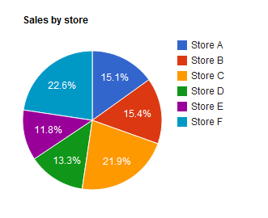
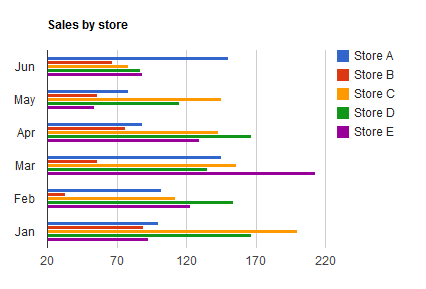

```{r setup, include=FALSE}
knitr::opts_chunk$set(echo = FALSE)
```


# Presentación tabular y gráfica univariada

## Gráficas para datos categóricas

Una *tabla estadística* se puede usar para mostrar los datos gráficamente como una distribución de datos.

Cuando la variable de interés es *cualitativa*, la tabla estadística es una lista de las categorías siendo consideradas junto con una medida de la frecuencia con que se presenta cada valor.

**Frecuencia absoluta**: el número de veces que aparece un valor, se representa con $f_i$ donde el subíndice representa cada uno de los valores. La suma de las frecuencias absolutas es igual al número total de datos, representado por $N$

$$f_1+f_2+f_3+...+f_n=N$$

que equivale a:

$$\sum\limits_{i=1}^n f_i = N$$


##

**Frecuencia relativa:** el resultado de dividir la frecuencia absoluta de un determinado valor entre el número total de datos, se representa por $n_i$ . La suma de las frecuencias relativas es igual a 1. Lo cual puede verse fácilmente si se factoriza $N$.

$$n_i=\frac{f_i}{N}$$

**Frecuencia acumulada:** la suma de frecuencias absolutas de todos los valores iguales o inferiores al valor considerado, se representa por  $F_i$.

**Frecuencia relativa acumulada:** el resultado de dividir la frecuencia acumulada entre el número total de datos, se representa por $N_i$.

(nótese que cuando se trata de acumuladas las letras que las representan están en mayúscula)

## Ejemplo

15  alumnos contestan a la pregunta de cuantos hermanos tienen. Las respuestas son:

$$1,1,2,0,3,2,1,4,2,3,1,0,0,1,2$$

A continuación construimos una tabla de frecuencias:

| Hermanos | Frecuencia absoluta $f_i$ | Frecuencia relativa $n_i$ | Frecuencia acumulada $F_i$ | Frecuencia relativa acumulada $N_i$ |
|:--------:|:-------------------------:|:-------------------------:|:--------------------------:|:-----------------------------------:|
|     0    |             3             |       $\frac{3}{15}$      |              3             |            $\frac{3}{15}$           |
|     1    |             5             |       $\frac{5}{15}$      |            3+5=8           |     $\frac{3}{15}+\frac{5}{15}$     |
|     2    |             4             |       $\frac{4}{15}$      |          3+5+4=12          |           $\frac{12}{15}$           |
|     3    |             2             |       $\frac{2}{15}$      |         3+5+4+2=14         |           $\frac{14}{15}$           |
|     4    |             1             |       $\frac{1}{15}$      |        3+5+4+2+1=15        |           $\frac{15}{15}$           |
|  $\sum$  |             15            |             1             |                            |                                     |

## Gráficas

Una vez que a las mediciones se les hayan dado categorías y se resumieron en una *tabla estadística*, se puede usar una **gráfica de pastel** o una **gráfica de barras** para mostrar la distribución de los datos. 

Una *gráfica de pastel* es la conocida gráfica circular que muestra la forma en que están distribuidas las medidas entre las categorías. Una *gráfica de barras* muestra la misma distribución de medidas en categorías, con la altura de la barra midiendo la frecuencia con la que se observa una categoría en particular.

 

## 

### Construcción de las gráficas

La *gráfica de barras* se construye con las frecuencias absolutas por categoría y para la *gráfica de pastel*, asigne un sector de círculo a cada categoría. El ángulo de cada sector debe ser proporcional a la magnitud de las mediciones (o frecuencia relativa) en esa categoría. La ecuación para hallar el ángulo es:

$$Ángulo= \text{􏰀 Frecuencia relativa}\times 􏰃 360°$$


```{r}
brothers <- c(1,1,2,0,3,2,1,4,2,3,1,0,0,1,2)

conteo <- table(brothers)
par(mfrow=c(1,2))
barplot(conteo, xlab = 'Número de hermanos')
pct <- round(conteo/sum(conteo)*100)
lbls <- paste(conteo, pct) # add percents to labels 
lbls <- paste(lbls,"%",sep="") # ad % to labels 
pie(conteo,labels = lbls, col=rainbow(length(lbls)),
  	main="Pie Chart de Número de hermanos")
```

